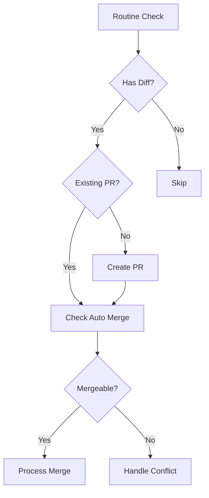

# Contributing to Pull

Hi there! We're thrilled that you'd like to contribute to this project. Your
help is essential for keeping it great.

Please note that this project is released with a
[Contributor Code of Conduct](CODE_OF_CONDUCT.md). By participating in this
project you agree to abide by its terms.

## Development Environment

### Prerequisites

- [Deno](https://deno.land/#installation) 2.1.1 or later
- MongoDB 8.0
- Redis 7.4

### Development Containers

We provide two development environments:

1. Base Environment:

```bash
devcontainer open .devcontainer/pull-base
```

2. Full Environment (includes monitoring tools which supports amd64 only):

```bash
devcontainer open .devcontainer/pull-full
```

The full environment includes additional tools:

- Mongo Express (port 8081)
- Redis Commander (port 8082)
- Bull Board (port 8083)

## Getting Started

1. Fork and clone the repository
2. Make sure you have [Deno](https://deno.land/#installation) installed
3. Install development hooks:
   ```bash
   deno task install-hooks
   ```
4. Set up your GitHub App. Follow the
   [Probot documentation](https://probot.github.io/docs/development/) for
   detailed instructions on creating a GitHub App.
5. Set up your environment variables by copying the `.env.example` file to
   `.env` and filling in the required values:
   ```sh
   cp .env.example .env
   ```
6. Start the development server:
   ```bash
   deno task dev
   ```
   Start the development worker:
   ```bash
   deno task worker
   ```

## Available Scripts

- `deno task dev`: Start the app in development mode
- `deno task dev:skip-full-sync`: Start without initial full sync
- `deno task worker`: Start the background worker
- `deno task test`: Run tests
- `deno task check`: Run linter and formatter checks
- `deno task full-sync`: Run full repository sync
- `deno task manual-process <owner>/<repo>`: Process specific repository

## Application Architecture

### Core Components

#### 1. Web Server (`src/index.ts`)

The main Express.js application that:

- Handles GitHub webhooks
- Serves API endpoints
- Initializes the scheduler

#### 2. Background Worker (`src/worker.ts`)

Processes repository sync jobs using BullMQ:

- Handles job concurrency
- Manages retries and failures
- Processes jobs based on priority

#### 3. Scheduler ([`@wei/probot-scheduler`](https://jsr.io/@wei/probot-scheduler))

Manages periodic repository checks:

- Schedules jobs using cron expressions
- Maintains job queues in Redis
- Handles job priorities and scheduling

#### 4. Database Layer

- **MongoDB**: Stores repository and installation data
- **Redis**: Manages job queues and caching
- **Connections**: Managed through `src/configs/database.ts` and
  `src/configs/redis.ts`

#### 5. Pull Processor (`src/processor/pull.ts`)

The Pull processor is the core component that handles repository
synchronization. Here's a detailed breakdown of its functionality:



##### Main Components

1. **Routine Check (`routineCheck`):**
   - Iterates through configured rules in `pull.yml`
   - For each rule:
     - Normalizes base and upstream branch names
     - Checks for differences between branches
     - Creates or updates pull requests as needed

2. **Difference Detection (`hasDiff`):**
   - Compares commits between base and upstream branches
   - Handles special cases:
     - Large diffs that timeout
     - Missing branches
     - No common ancestor
   - Returns true if changes are detected

3. **Pull Request Management:**
   - **Updates (`getOpenPR`):**
     - Finds existing PRs created by the bot
     - Validates PR matches current sync rule
   - **Creation (`createPR`):**
     - Creates new pull request with standardized title
     - Assigns reviewers and labels
     - Updates PR body with tracking information

4. **Merge Process (`checkAutoMerge`, `processMerge`):**
   - Supports multiple merge methods:
     - `none`: No automatic merging
     - `merge`: Standard merge commit
     - `squash`: Squash and merge
     - `rebase`: Rebase and merge
     - `hardreset`: Force push to base branch
   - Handles merge conflicts:
     - Adds conflict label
     - Assigns conflict reviewers
     - Updates PR status

##### Error Handling

The processor implements robust error handling:

- Retries for mergeable status checks
- Graceful handling of GitHub API limitations
- Detailed logging for debugging
- Conflict resolution workflows

##### Best Practices

When modifying the Pull processor:

1. Maintain idempotency in operations
2. Implement proper error handling
3. Add detailed logging for debugging
4. Consider edge cases

## Submitting a Pull Request

1. Create a new branch: `git checkout -b my-branch-name`
2. Make your changes
3. Make sure the tests pass:
   ```bash
   deno test
   ```
4. Format your code:
   ```bash
   deno fmt
   ```
5. Run the linter:
   ```bash
   deno lint
   ```
6. Push to your fork and submit a pull request
7. Pat yourself on the back and wait for your pull request to be reviewed and
   merged

Here are a few things you can do that will increase the likelihood of your pull
request being accepted:

- Follow the style guide enforced by Deno's built-in formatter. You can format
  your code by running `deno fmt`
- Write and update tests
- Keep your changes as focused as possible. If there are multiple changes you
  would like to make that are not dependent upon each other, consider submitting
  them as separate pull requests
- Write a
  [good commit message](http://tbaggery.com/2008/04/19/a-note-about-git-commit-messages.html)

Work in Progress pull requests are also welcome to get feedback early on, or if
there is something blocked you.

## Resources

- [How to Contribute to Open Source](https://opensource.guide/how-to-contribute/)
- [Using Pull Requests](https://help.github.com/articles/about-pull-requests/)
- [GitHub Help](https://help.github.com)
- [Deno Manual](https://deno.land/manual)

## License

By contributing, you agree that your contributions will be licensed under its
MIT License.
